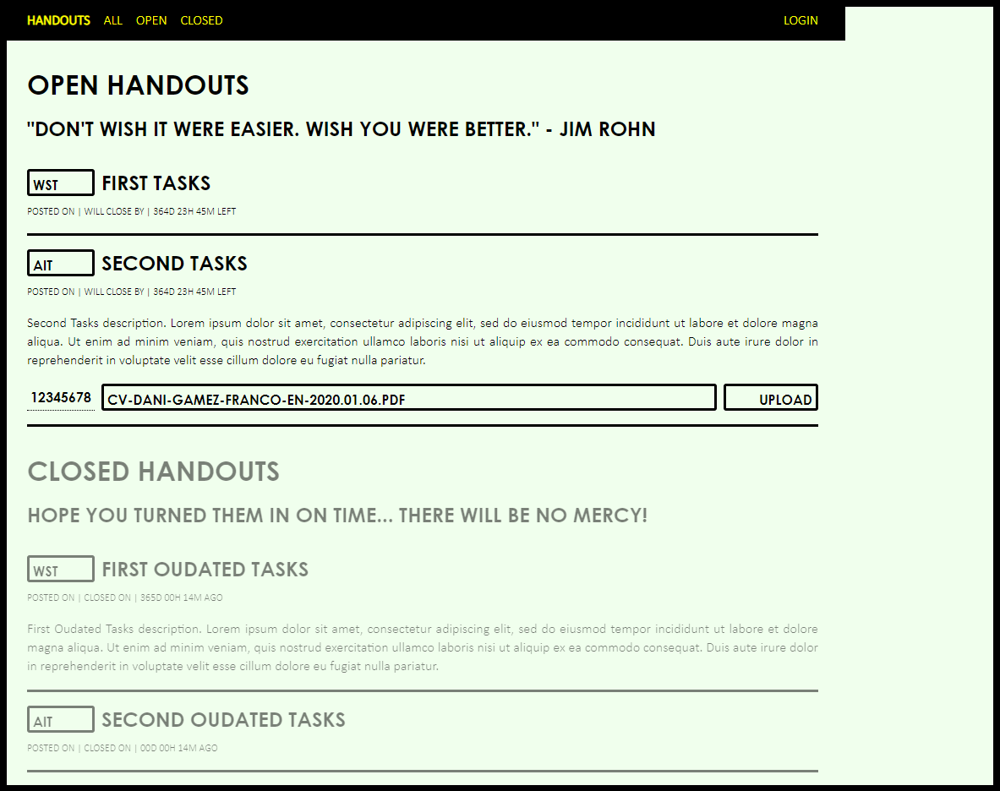

handouts.js
===========

**Please, be aware this is an old and outdated hackathon-like / weekend project. I just left it here as a reference, but even if you are planning on doing something similar, you are probably better of starting from scratch.**

A simple Node.js app built on top of Express to handle file uploads from students to tasks or assignments set by teachers.

This is how the main (student) page looks like:

Running It
----------

First, clone the project and run `npm install`.

Open two terminals and run MongoDB using with `mongod` and `mongo`. In the `mongo` one, use the commands in the `MongoDB Test Data` section to pre-populate the database with some test data.

Now, run `npm start`. You should be able to access the project at `http://localhost:3000`.    

You can use any either `Alice` or `Bob` + `12345678` if you want to see the admin-only features.

MongoDB Test Data
-----------------

Just copy this and paste it in a MongoDB terminal.

### Assignments:

    use handouts;

    db.handouts.insert({
      "subject" : {
      "abbr" : "WST",
      "name" : "Web Systems and Technologies"
      },
      "title" : "First Tasks",
      "d0" : new Date(),
      "df" : new Date(new Date().getTime() + 31536000000),
      "description" : "First Tasks description. Lorem ipsum dolor sit amet, consectetur adipiscing elit, sed do eiusmod tempor incididunt ut labore et dolore magna aliqua. Ut enim ad minim veniam, quis nostrud exercitation ullamco laboris nisi ut aliquip ex ea commodo consequat. Duis aute irure dolor in reprehenderit in voluptate velit esse cillum dolore eu fugiat nulla pariatur."
    });
    
    db.handouts.insert({
      "subject" : {
      "abbr" : "AIT",
      "name" : "Advanced Internet Technologies"
      },
      "title" : "Second Tasks",
      "d0" : new Date(),
      "df" : new Date(new Date().getTime() + 31536000000),
      "description" : "Second Tasks description. Lorem ipsum dolor sit amet, consectetur adipiscing elit, sed do eiusmod tempor incididunt ut labore et dolore magna aliqua. Ut enim ad minim veniam, quis nostrud exercitation ullamco laboris nisi ut aliquip ex ea commodo consequat. Duis aute irure dolor in reprehenderit in voluptate velit esse cillum dolore eu fugiat nulla pariatur."
    });
    
    db.handouts.insert({
      "subject" : {
      "abbr" : "WST",
      "name" : "Web Systems and Technologies"
      },
      "title" : "First Oudated Tasks",
      "d0" : new Date(),
      "df" : new Date(new Date() - 31536000000),
      "description" : "First Oudated Tasks description. Lorem ipsum dolor sit amet, consectetur adipiscing elit, sed do eiusmod tempor incididunt ut labore et dolore magna aliqua. Ut enim ad minim veniam, quis nostrud exercitation ullamco laboris nisi ut aliquip ex ea commodo consequat. Duis aute irure dolor in reprehenderit in voluptate velit esse cillum dolore eu fugiat nulla pariatur."
    });
    
    db.handouts.insert({
      "subject" : {
      "abbr" : "AIT",
      "name" : "Advanced Internet Technologies"
      },
      "title" : "Second Oudated Tasks",
      "d0" : new Date(),
      "df" : new Date(),
      "description" : "Second Oudated Tasks description. Lorem ipsum dolor sit amet, consectetur adipiscing elit, sed do eiusmod tempor incididunt ut labore et dolore magna aliqua. Ut enim ad minim veniam, quis nostrud exercitation ullamco laboris nisi ut aliquip ex ea commodo consequat. Duis aute irure dolor in reprehenderit in voluptate velit esse cillum dolore eu fugiat nulla pariatur."
    });
    
### Subjects:

    use handouts;

    db.subjects.insert({
      "abbr" : "AIT",
      "name" : "Advanced Internet Technologies"
    });
    
    db.subjects.insert({
      "abbr" : "WST",
      "name" : "Web Systems and Technologies"
    });
